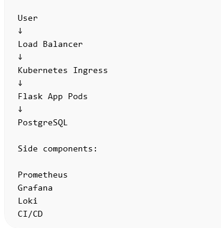

# Production Grade DevOps Platform

## Project Goal

This project demonstrates a **production-grade DevOps platform** that implements real-world DevOps practices including:

- Infrastructure as Code
- CI/CD automation
- Kubernetes orchestration
- Security scanning
- Secrets management
- Monitoring and alerting
- Centralized logging
- GitOps deployments

The project simulates how a real company builds and deploys a scalable backend system.

---

# Technology Stack

## Cloud Provider

AWS

## Infrastructure

Terraform

## Configuration Management

Ansible

## Containerization

Docker

## Container Orchestration

Kubernetes (EKS)

## Packaging

Helm

## CI/CD

GitHub Actions / Jenkins

## Artifact Repository

AWS ECR / JFrog Artifactory

## Secrets Management

Hashicorp Vault / AWS Secrets Manager

## Monitoring

Prometheus  
Grafana  
Alertmanager

## Logging

Loki

## Security

Trivy  
Kubernetes RBAC  
Network Policies

## GitOps

ArgoCD

---

# System Architecture Overview

The system follows a modern cloud-native architecture.

Application components are deployed inside a Kubernetes cluster, while infrastructure is provisioned using Terraform.

CI/CD pipelines automatically build, scan, and deploy applications to the cluster.

Monitoring, logging, and alerting provide observability for the entire system.

---

# Architecture Diagram

(Add architecture diagram image here)

Example:

