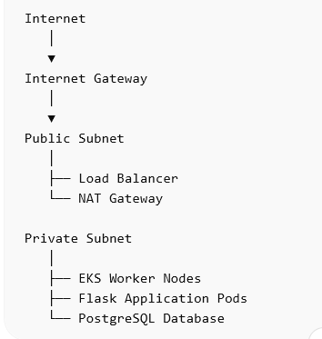

# Network Architecture

## 1. Introduction

This document describes the network architecture of the platform.

The network is designed following cloud security best practices where public exposure is minimized and internal services are isolated in private networks.

The infrastructure will be created using Terraform.

---

# 2. Virtual Private Cloud (VPC)

The system will run inside a Virtual Private Cloud (VPC).

The VPC provides an isolated network environment for all cloud resources.

The VPC will contain multiple subnets across different availability zones for high availability.

---

# 3. Subnet Design

The network will include both public and private subnets.

## Public Subnets

Public subnets contain resources that must be accessible from the internet.

Resources placed in public subnets:

- Application Load Balancer
- NAT Gateway

---

## Private Subnets

Private subnets contain internal infrastructure components.

Resources placed in private subnets:

- Kubernetes worker nodes
- Application pods
- Monitoring stack
- Logging stack
- PostgreSQL database

Private subnets prevent direct internet access to sensitive resources.

---

# 4. Internet Gateway

The VPC will include an Internet Gateway.

The Internet Gateway allows resources in public subnets to communicate with the internet.

The Application Load Balancer will use this gateway to receive traffic from users.

---

# 5. NAT Gateway

Resources inside private subnets sometimes require internet access.

Examples include:

- downloading container images
- fetching security updates
- accessing external APIs

A NAT Gateway will be used to allow outbound internet access from private subnets while still blocking inbound traffic.

---

# 6. Security Groups

Security groups act as virtual firewalls.

They control inbound and outbound traffic to cloud resources.

Example rules:

Load Balancer:

- allow HTTP (80)
- allow HTTPS (443)

Kubernetes Nodes:

- allow traffic from load balancer

Database:

- allow traffic only from application pods

---

# 7. High Availability

To ensure high availability, resources will be distributed across multiple availability zones.

This prevents system downtime if one zone fails.

---

# 8. Network Diagram

(Add network architecture diagram here)

Example:

