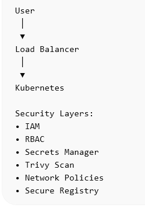

# Security Architecture

## 1. Introduction

This document describes the security architecture of the platform.

Security is implemented using a layered approach to protect infrastructure, applications, and data.

The platform follows the principle of **defense in depth**, where multiple security mechanisms work together to reduce risk.

---

# 2. Identity and Access Management (IAM)

Access to cloud resources will be controlled using IAM policies and roles.

Principles followed:

- Least privilege access
- Role-based access
- No long-lived credentials

Terraform will provision IAM roles for:

- Kubernetes cluster
- CI/CD pipelines
- monitoring components

Developers and operators will authenticate using IAM roles instead of static credentials.

---

# 3. Kubernetes RBAC

Role-Based Access Control (RBAC) will restrict access inside the Kubernetes cluster.

RBAC policies will control:

- who can deploy applications
- who can view logs
- who can manage infrastructure

Example roles:

- cluster-admin
- developer
- read-only observer

This prevents unauthorized modifications to cluster resources.

---

# 4. Secrets Management

Sensitive data must never be stored in source code or container images.

Examples of secrets:

- database credentials
- JWT signing keys
- API tokens

Secrets will be stored securely using a secrets management solution.

Possible implementations:

- Hashicorp Vault
- AWS Secrets Manager
- Kubernetes Secrets (for development environments)

Applications will retrieve secrets at runtime.

---

# 5. Container Security

Container images will be scanned for vulnerabilities before deployment.

Security scanning tools:

- Trivy
- Snyk (optional)

Scanning occurs during the CI pipeline.

Images with critical vulnerabilities will fail the pipeline.

---

# 6. Kubernetes Network Policies

Network policies restrict communication between pods.

Example rules:

- Application pods may communicate with the database
- Monitoring components may scrape metrics
- Other pods cannot directly access the database

This reduces lateral movement inside the cluster.

---

# 7. Secure Image Registry

Container images will be stored in a secure registry.

Options include:

- AWS ECR
- JFrog Artifactory

Access to the registry will be restricted using IAM permissions.

---

# 8. CI/CD Security

The CI/CD pipeline will enforce security checks before deployment.

Pipeline security stages include:

- dependency scanning
- container vulnerability scanning
- policy validation

Secrets used in pipelines will be stored securely using secret management tools.

---

# 9. Logging and Audit

Security events will be logged and monitored.

Examples include:

- failed login attempts
- unauthorized access attempts
- suspicious API activity

Logs will be collected using Loki and analyzed through Grafana dashboards.

---

# 10. Security Diagram

(Add security architecture diagram here)

Example:

