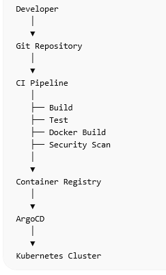

# CI/CD Architecture

## 1. Introduction

This document describes the Continuous Integration and Continuous Deployment (CI/CD) architecture of the platform.

The goal of the CI/CD system is to automate the process of building, testing, securing, and deploying the application.

Automation ensures faster delivery, reduced human error, and consistent deployments.

---

# 2. CI/CD Objectives

The CI/CD pipeline will automate the following processes:

- application build
- automated testing
- container image creation
- security scanning
- artifact storage
- Kubernetes deployment

This ensures that every code change follows a consistent deployment process.

---

# 3. Source Code Management

Source code will be stored in Git repositories.

The platform will use the following repositories:

Application Repository

Contains:

- Python application code
- Dockerfile
- Helm chart
- CI pipeline configuration

Infrastructure Repository

Contains:

- Terraform infrastructure code
- network definitions
- cluster provisioning

GitOps Repository

Contains:

- Kubernetes deployment manifests
- environment configurations

---

# 4. Pipeline Stages

The CI/CD pipeline will include multiple stages.

### Stage 1 — Code Commit

Developers push code changes to the Git repository.

This triggers the CI pipeline automatically.

---

### Stage 2 — Build

The application is built and dependencies are installed.

Example tasks:

- install Python dependencies
- run linting checks

---

### Stage 3 — Automated Testing

Basic tests are executed to ensure code stability.

Examples:

- unit tests
- API tests

---

### Stage 4 — Docker Image Build

The application is packaged into a Docker container image.

Example:

docker build -t registration-app:v1 .

---

### Stage 5 — Container Security Scan

The container image is scanned for vulnerabilities.

Security tool:

Trivy

Images with critical vulnerabilities will fail the pipeline.

---

### Stage 6 — Push Image to Registry

The container image is pushed to a secure registry.

Possible registries:

- AWS ECR
- JFrog Artifactory

---

### Stage 7 — Update Deployment Configuration

Deployment manifests or Helm values are updated with the new image version.

This triggers deployment through the GitOps system.

---

### Stage 8 — Deployment

The application is deployed to Kubernetes.

Deployment strategy:

Rolling updates

---

# 5. Environment Promotion

The system uses multiple environments.

Development Environment

Used for developer testing.

Staging Environment

Used for QA validation.

Production Environment

Serves real users.

Promotion between environments follows controlled approvals.

Example flow:

dev → staging → production

---

# 6. GitOps Deployment

The platform will use GitOps principles for deployments.

Tools:

ArgoCD

ArgoCD continuously monitors the Git repository and ensures the cluster state matches the declared configuration.

This provides:

- automated deployment
- version control for infrastructure
- easier rollback

---

# 7. Artifact Flow

Application code → CI Pipeline → Docker Image → Container Registry → Kubernetes Deployment

---

# 8. CI/CD Diagram

(Add CI/CD architecture diagram here)

Example:

