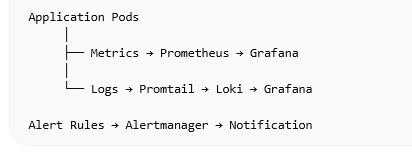

# Observability Architecture

## 1. Introduction

This document describes the observability strategy of the platform.

Observability allows engineers to understand the internal state of the system by analyzing metrics, logs, and alerts.

The platform will implement monitoring, logging, and alerting to ensure reliability and quick incident response.

---

# 2. Observability Goals

The system should provide visibility into:

- application performance
- infrastructure health
- error rates
- request latency
- resource utilization

Observability helps detect issues early and maintain system reliability.

---

# 3. Monitoring Architecture

Monitoring will be implemented using the Prometheus ecosystem.

Components:

Prometheus  
Grafana  
Alertmanager  
Node Exporter  
Kube State Metrics

---

# 4. Metrics Collection

Prometheus collects metrics from multiple sources.

Metrics sources include:

- Kubernetes nodes
- application pods
- container resource usage
- HTTP request metrics

The application exposes metrics through the `/metrics` endpoint.

---

# 5. Visualization

Grafana will be used to visualize metrics.

Grafana dashboards will display:

- CPU usage
- memory usage
- pod status
- request rates
- response latency
- error rates

These dashboards allow operators to quickly understand system health.

---

# 6. Alerting

Alertmanager will handle alerts triggered by Prometheus rules.

Example alerts:

High CPU usage  
Pod crash loops  
High error rates  
Application downtime

Alerts may be sent to:

- Email
- Slack
- PagerDuty

Alerts ensure operators are notified when system issues occur.

---

# 7. Logging Architecture

The platform will implement centralized logging.

Logging stack:

Loki  
Promtail  
Grafana

---

# 8. Log Collection

Promtail collects logs from containers running inside Kubernetes.

These logs are sent to Loki for storage and indexing.

Logs include:

- application logs
- container logs
- system logs

---

# 9. Log Analysis

Logs will be visualized in Grafana.

Engineers can search logs to investigate incidents, debug errors, and analyze system behavior.

---

# 10. Health Monitoring

The application exposes a health endpoint:

/health

Kubernetes uses this endpoint for:

- liveness probes
- readiness probes

This ensures unhealthy containers are automatically restarted.

---

# 11. Observability Diagram

(Add observability architecture diagram here)

Example:

