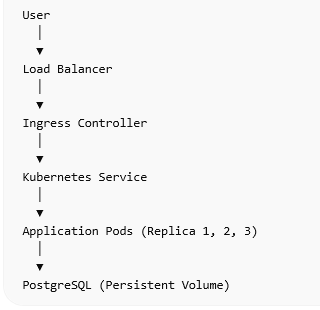

# Deployment Architecture

## 1. Introduction

This document describes how the application will be deployed and operated inside the Kubernetes environment.

The deployment architecture ensures that the platform is scalable, resilient, and easy to update without downtime.

The application will be packaged as a Docker container and deployed to Kubernetes using Helm charts.

---

# 2. Containerization

The backend application will be packaged into a Docker container.

Containerization provides the following benefits:

- consistent runtime environment
- portability across environments
- simplified deployment
- isolation between services

The Docker image will be built in the CI pipeline and pushed to a container registry.

Possible container registries:

- AWS ECR
- JFrog Artifactory

---

# 3. Kubernetes Deployment Model

The application will run inside Kubernetes pods.

A Kubernetes Deployment resource will manage the application pods.

Responsibilities of the Deployment resource include:

- maintaining the desired number of pods
- performing rolling updates
- automatically restarting failed containers

Example components:

Application Deployment  
Kubernetes Service  
Ingress Controller

---

# 4. Helm Based Deployment

Application deployments will be managed using Helm charts.

Helm provides a templating system for Kubernetes manifests and simplifies application packaging.

Helm charts allow:

- parameterized deployments
- versioned application releases
- simplified upgrades and rollbacks

Each application version will correspond to a Helm release.

---

# 5. Deployment Strategy

The platform will use **rolling updates** for application deployment.

Rolling updates ensure that:

- new pods start before old pods terminate
- application downtime is minimized
- deployments can be safely rolled back if needed

Kubernetes automatically manages the transition between versions.

---

# 6. Horizontal Scaling

The application will support horizontal scaling using Kubernetes.

Multiple application pods can run simultaneously to handle increased traffic.

Scaling can be performed using:

Horizontal Pod Autoscaler (HPA)

Metrics used for scaling may include:

- CPU usage
- memory usage
- request rate

---

# 7. Database Deployment

The platform will use PostgreSQL for persistent storage.

The database requires persistent storage to ensure data is not lost when pods restart.

Persistent storage will be implemented using:

Persistent Volume (PV)  
Persistent Volume Claim (PVC)

The database may be deployed using:

- Helm charts
- managed cloud database service (future enhancement)

---

# 8. Service Exposure

Application pods will be exposed using a Kubernetes Service.

Service type:

ClusterIP

External traffic will enter the cluster through an Ingress Controller.

The Ingress Controller routes requests to the appropriate service.

---

# 9. Health Checks

Kubernetes will monitor application health using probes.

Two probes will be configured:

Liveness Probe  
Ensures the container is running correctly.

Readiness Probe  
Ensures the container is ready to receive traffic.

Both probes will use the `/health` endpoint.

---

# 10. Deployment Diagram

(Add deployment architecture diagram here)

Example:

